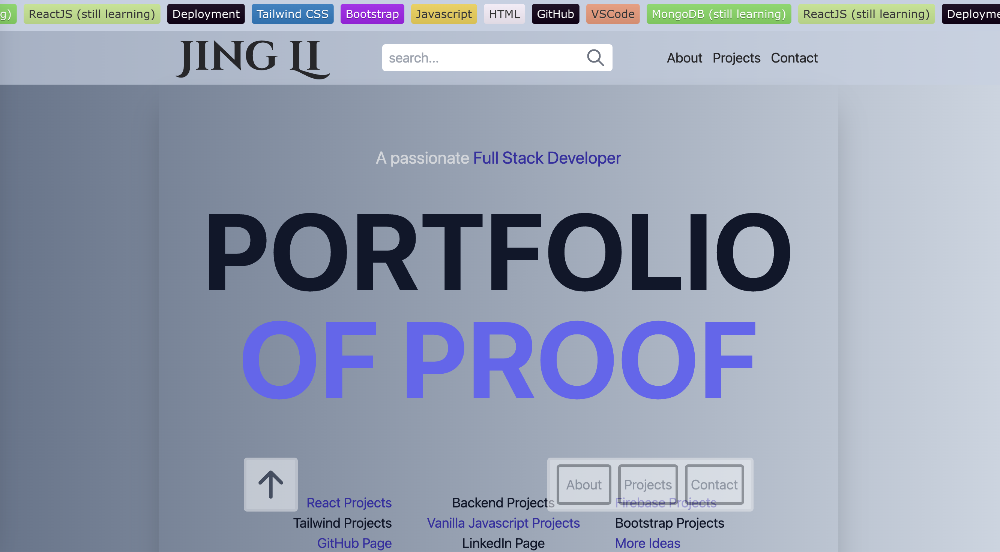
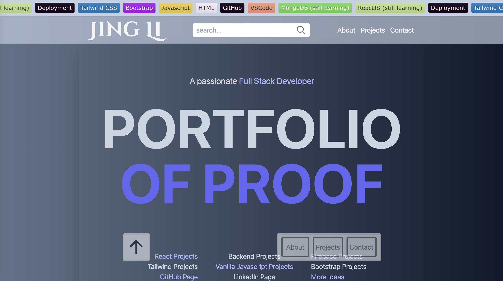

# Tailwind Portfolio
Welcome to my portfolio! I designed it completely new with ***Tailwind CSS***.

---
## Preview

---
## Features
- It should be demanding in skill, but still be straight forward. The most importand things are quick noticeable, for example the scrolling bar at the top, where you can find my Tech Stack
- Animated galarie of websites, which direct you conveniently to my projects
- In Projects Section, there are more detailed infos about each project
- This responsive portfolio has a Dark Mode
- I'll continuously work on it and implement it with some cool Javascript features
  
---
## Deployment
This page is published on [Render](https://render.com/)

---
## Links
To visit another portfolio of mine, which is designed with ***plain CSS***, please click here:  [portfolio](https://jili0.me/portfolio/)
